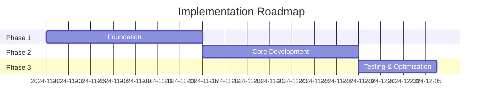

---
allowed-tools:
  - Read
  - Grep
  - Glob
  - WebSearch
  - WebFetch
  - Task
argument-hint: "[problema o domanda da analizzare]"
description: "Modalità di analisi profonda per problemi complessi"
model: opus
---

# Toduba Ultra Think - Analisi Profonda e Problem Solving 🧠

## Obiettivo
Attivare modalità di analisi profonda per esplorare problemi complessi da molteplici prospettive, generare soluzioni innovative e fornire raccomandazioni strategiche.

## Argomenti
Problema o domanda da analizzare: $ARGUMENTS

## Processo Ultra Think

### Fase 1: Comprensione Profonda del Problema

```
1. PARSING DEL PROBLEMA
   - Identificare il core challenge
   - Estrarre requisiti espliciti e impliciti
   - Riconoscere stakeholder e vincoli
   - Mappare dipendenze e interconnessioni

2. QUESTIONING ASSUMPTIONS
   - Cosa stiamo dando per scontato?
   - Quali bias potrebbero influenzarci?
   - Esistono precedenti o pattern simili?
   - Quali sono i veri obiettivi?
```

### Fase 2: Analisi Multi-Dimensionale

#### Dimensione Tecnica
```
- Fattibilità tecnologica
- Complessità implementativa
- Scalabilità e performance
- Debito tecnico e manutenibilità
- Sicurezza e affidabilità
```

#### Dimensione Business
```
- Valore generato vs costo
- Time to market
- ROI e metriche di successo
- Rischi e opportunità
- Vantaggio competitivo
```

#### Dimensione Utente
```
- User experience e usabilità
- Learning curve
- Valore percepito
- Pain points risolti
- Adozione e retention
```

#### Dimensione Sistemica
```
- Impatto su sistema esistente
- Effetti di secondo e terzo ordine
- Feedback loops
- Emergent behaviors
- Evolutionary path
```

### Fase 3: Generazione Soluzioni Creative

```typescript
const generateSolutions = () => {
  const approaches = [];

  // Approccio Convenzionale
  approaches.push({
    name: "Standard Industry Solution",
    description: "Seguire best practices consolidate",
    pros: ["Rischio basso", "Documentazione disponibile", "Talent pool ampio"],
    cons: ["Nessun vantaggio competitivo", "Possibili limitazioni"],
    complexity: "Media",
    timeToImplement: "3-4 mesi",
    risk: "Basso"
  });

  // Approccio Innovativo
  approaches.push({
    name: "Cutting-Edge Technology",
    description: "Utilizzare tecnologie emergenti",
    pros: ["Vantaggio competitivo", "Future-proof", "Performance superiori"],
    cons: ["Rischio alto", "Learning curve", "Pochi esperti"],
    complexity: "Alta",
    timeToImplement: "6-8 mesi",
    risk: "Alto"
  });

  // Approccio Ibrido
  approaches.push({
    name: "Phased Hybrid Approach",
    description: "Mix di proven e innovative",
    pros: ["Bilanciato", "Riduce rischi", "Evolutivo"],
    cons: ["Complessità architetturale", "Possibili compromessi"],
    complexity: "Media-Alta",
    timeToImplement: "4-6 mesi",
    risk: "Medio"
  });

  // Approccio Minimale
  approaches.push({
    name: "MVP First",
    description: "Minimo prodotto funzionante, poi iterare",
    pros: ["Fast time to market", "Validazione rapida", "Costo iniziale basso"],
    cons: ["Possibile refactoring", "Feature limitate inizialmente"],
    complexity: "Bassa",
    timeToImplement: "1-2 mesi",
    risk: "Basso"
  });

  return approaches;
};
```

### Fase 4: Analisi Comparativa e Trade-offs

```markdown
## Matrice Decisionale

| Criterio | Peso | Sol. A | Sol. B | Sol. C | Sol. D |
|----------|------|--------|--------|--------|--------|
| Performance | 25% | 7/10 | 9/10 | 8/10 | 5/10 |
| Costo | 20% | 6/10 | 4/10 | 5/10 | 9/10 |
| Time to Market | 20% | 5/10 | 3/10 | 6/10 | 9/10 |
| Scalabilità | 15% | 8/10 | 9/10 | 7/10 | 4/10 |
| Manutenibilità | 10% | 8/10 | 6/10 | 7/10 | 6/10 |
| Rischio | 10% | 8/10 | 4/10 | 6/10 | 9/10 |

**Score Pesato:**
- Soluzione A: 6.8
- Soluzione B: 6.3
- Soluzione C: 6.6
- Soluzione D: 6.9 ⭐
```

### Fase 5: Deep Dive sulla Soluzione Raccomandata

```
SOLUZIONE RACCOMANDATA: [Nome]

## Razionale
[Spiegazione dettagliata del perché questa soluzione]

## Piano di Implementazione
1. Fase 1 (Settimana 1-2)
   - Setup infrastruttura base
   - Proof of concept core functionality
   - Validazione approccio

2. Fase 2 (Settimana 3-6)
   - Sviluppo features principali
   - Integrazione con sistemi esistenti
   - Testing iniziale

3. Fase 3 (Settimana 7-8)
   - Ottimizzazione performance
   - Security hardening
   - Documentazione

## Metriche di Successo
- KPI 1: [Metrica specifica]
- KPI 2: [Metrica specifica]
- KPI 3: [Metrica specifica]

## Risk Mitigation
- Rischio A → Strategia di mitigazione
- Rischio B → Strategia di mitigazione
- Rischio C → Piano di contingenza
```

### Fase 6: Pensiero Laterale e Alternative

```
ALTERNATIVE NON CONVENZIONALI:

1. "E se non risolvessimo il problema?"
   - Il problema potrebbe risolversi da solo?
   - Possiamo convivere con esso?
   - C'è valore nel non-agire?

2. "E se invertissimo il problema?"
   - Invece di X, facciamo l'opposto
   - Trasformare il bug in feature
   - Abbracciare il constraint

3. "E se lo delegassimo?"
   - Outsourcing strategico
   - Crowdsourcing
   - AI/Automazione

4. "E se cambiassimo le regole?"
   - Ridefinire il problema
   - Cambiare i vincoli
   - Nuovo paradigma
```

### Fase 7: Sintesi e Raccomandazioni

## Output Report Ultra Think

```markdown
# 🧠 Toduba Ultra Think Analysis

## Executive Summary
[2-3 paragrafi di sintesi ad alto livello]

## Il Problema Analizzato
- **Core Challenge**: [Descrizione]
- **Stakeholder Impattati**: [Lista]
- **Vincoli Critici**: [Lista]
- **Timeline**: [Urgenza]

## Analisi Multi-Prospettiva

### 🔧 Prospettiva Tecnica
[Insights tecnici chiave]

### 💼 Prospettiva Business
[Considerazioni business]

### 👤 Prospettiva Utente
[Impact su user experience]

### 🌐 Prospettiva Sistemica
[Effetti sul sistema complessivo]

## Soluzioni Proposte

### Opzione 1: [Nome] ⭐ RACCOMANDATA
**Descrizione**: [Dettagli]
**Pro**: [Lista]
**Contro**: [Lista]
**Implementazione**: [Timeline]
**Costo Stimato**: [Range]
**Rischio**: [Livello]

### Opzione 2: [Nome]
[Simile struttura]

### Opzione 3: [Nome]
[Simile struttura]

## Raccomandazione Strategica

### Approccio Consigliato
[Descrizione dettagliata della strategia raccomandata]

### Roadmap


### Success Metrics
1. [Metrica 1 con target]
2. [Metrica 2 con target]
3. [Metrica 3 con target]

## Rischi e Mitigazioni

| Rischio | Probabilità | Impatto | Mitigazione |
|---------|------------|---------|-------------|
| [Risk 1] | Alta | Alto | [Strategia] |
| [Risk 2] | Media | Medio | [Strategia] |

## Considerazioni Finali

### Punti Chiave
- 💡 [Insight principale]
- 💡 [Insight secondario]
- 💡 [Considerazione importante]

### Aree di Incertezza
- ❓ [Area che richiede più dati]
- ❓ [Assunzione da validare]

### Next Steps Immediati
1. [Azione 1]
2. [Azione 2]
3. [Azione 3]

## Confidence Level
- **Analisi**: 95% confidence
- **Raccomandazione**: 85% confidence
- **Success Probability**: 75%

---
*Analisi generata da Toduba Ultra Think System*
*Tempo di analisi: [X] minuti*
*Profondità: Maximum*
```

## Integrazione con Orchestrator

L'orchestrator usa sempre Ultra Think per task complessi:
```typescript
// Automaticamente invocato per analisi iniziale
const performUltraThink = async (task) => {
  const analysis = await ultraThink.analyze(task);

  // Presenta all'utente
  await presentAnalysis(analysis);

  // Attende conferma
  const userFeedback = await getUserConfirmation();

  // Itera se necessario
  if (userFeedback.requiresChanges) {
    return performUltraThink(refinedTask);
  }

  return analysis;
};
```

## Principi Guida Ultra Think
1. **First Principles Thinking** - Scomporre ai fondamentali
2. **Systems Thinking** - Vedere interconnessioni
3. **Lateral Thinking** - Esplorare l'inaspettato
4. **Critical Thinking** - Questionare tutto
5. **Creative Thinking** - Generare novità
6. **Strategic Thinking** - Visione long-term
7. **Probabilistic Thinking** - Gestire incertezza
8. **Ethical Thinking** - Considerare implicazioni morali