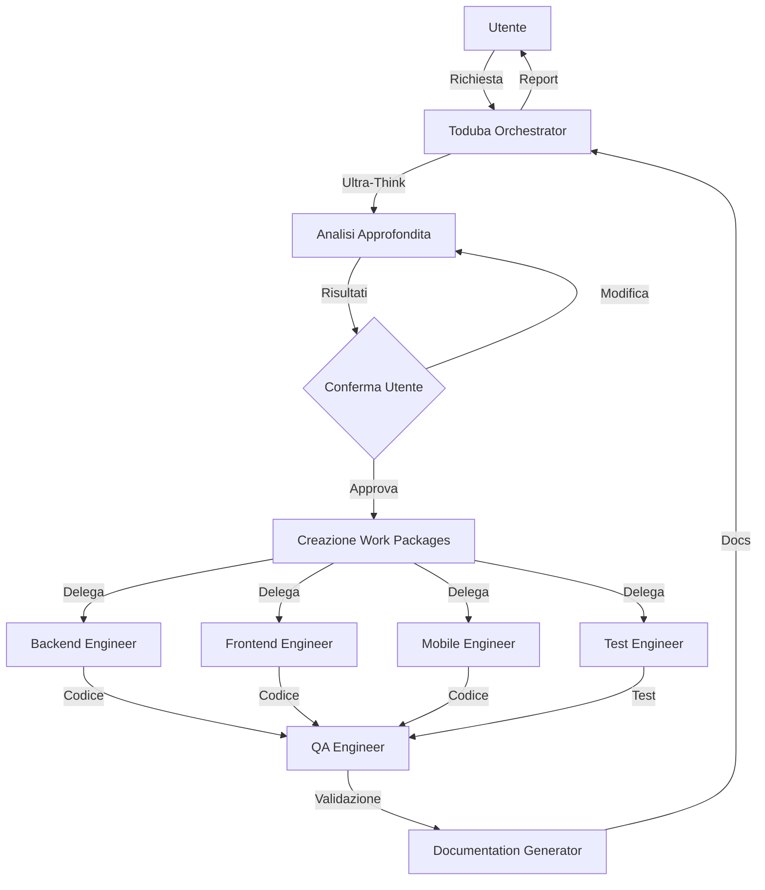

# Architettura Toduba Plugin System v2.0

## 📐 Panoramica Architetturale

Il Toduba Plugin System implementa un'architettura **multi-agent orchestration** con pattern di coordinamento centralizzato. Il sistema è progettato per massimizzare separazione delle responsabilità, scalabilità e manutenibilità.

## 🏛️ Pattern Architetturali

### Orchestrator-Workers Pattern



### Principi di Design

1. **Separation of Concerns**
   - Ogni agente ha una responsabilità specifica
   - Orchestrator non implementa mai direttamente
   - QA esegue test, Test Engineer li scrive

2. **Single Source of Truth**
   - Work packages come contratto tra orchestrator e agenti
   - Workspace centralizzato per artifacts
   - Metadata.json per stato documentazione

3. **Principle of Least Privilege**
   - Ogni agente ha accesso solo ai tool necessari
   - Orchestrator usa solo Task tool
   - Agenti specializzati usano tool specifici

## 🔧 Componenti del Sistema

### Layer 1: Orchestrazione

#### Toduba Orchestrator
**Responsabilità**: Coordinamento centrale, non implementazione

**Tools**: `Task` (esclusivamente)

**Workflow**:
1. Riceve richiesta utente
2. Esegue ultra-think analysis (3 modalità)
3. Presenta analisi strutturata all'utente
4. Itera fino a conferma utente
5. Crea work packages dettagliati
6. Delega agli agenti specializzati
7. Monitora progresso e consolida risultati

**Ultra-Think Modes**:
- **Quick** (30s): Analisi rapida per task semplici
- **Standard** (2min): Analisi completa per task medi
- **Deep** (5min): Analisi estensiva per task complessi

### Layer 2: Agenti di Sviluppo

#### Backend Engineer
**Focus**: API, database, server-side logic

**Tools**: `Read`, `Write`, `Edit`, `Bash`, `Glob`, `Grep`

**MCP Servers**: MongoDB, Memory

**Competenze**:
- REST/GraphQL API design
- Database schema e query optimization
- Authentication/Authorization
- Microservices architecture

#### Frontend Engineer
**Focus**: UI/UX, client-side development

**Tools**: `Read`, `Write`, `Edit`, `Bash`, `Glob`, `Grep`

**MCP Servers**: Playwright, Memory

**Competenze**:
- React, TypeScript, modern frameworks
- State management (Redux, Context)
- Responsive design, accessibility
- Browser testing con Playwright

#### Mobile Engineer
**Focus**: Flutter development cross-platform

**Tools**: `Read`, `Write`, `Edit`, `Bash`, `Glob`, `Grep`

**MCP Servers**: Memory

**Competenze**:
- Flutter/Dart development
- iOS e Android best practices
- State management (Provider, Riverpod, Bloc)
- Native bridge integration

### Layer 3: Quality Assurance

#### Test Engineer
**Responsabilità**: **SCRIVE** test (non li esegue)

**Tools**: `Read`, `Write`, `Edit`, `Glob`, `Grep`

**Output**: Test files (unit, integration, e2e)

**Focus**:
- Test design e strategia
- Coverage optimization
- Mock/stub creation
- Test documentation

#### QA Engineer
**Responsabilità**: **ESEGUE** test (non li scrive)

**Tools**: `Bash`, `Read`, `Grep`

**MCP Servers**: Playwright (per e2e testing)

**Focus**:
- Test execution e reporting
- Bug identification
- Performance testing
- Visual regression testing

### Layer 4: Analisi e Documentazione

#### Codebase Analyzer
**Focus**: Analisi architettura e dipendenze

**Tools**: `Read`, `Glob`, `Grep`

**MCP Servers**: Memory (per caching)

**Output**:
- Dependency graphs
- Architecture diagrams
- Code metrics
- Refactoring suggestions

#### Documentation Generator
**Focus**: Generazione e manutenzione docs

**Tools**: `Read`, `Write`, `Edit`, `Glob`

**Output**:
- Markdown documentation
- HTML/PDF exports
- API documentation
- Architecture diagrams

## 📦 Work Packages

I work packages sono il contratto tra orchestrator e agenti specializzati.

### Struttura Work Package

```markdown
# Work Package: [TASK_ID] - [AGENT_NAME]

## Contesto
- Richiesta originale utente
- Risultati ultra-think analysis
- Decisioni approvate dall'utente

## Obiettivo
- Descrizione chiara e specifica
- Success criteria misurabili
- Vincoli e limitazioni

## Specifiche Tecniche
- Tecnologie da utilizzare
- Pattern architetturali
- Best practices da seguire
- API/interfaces da rispettare

## Success Criteria
- Test da passare
- Metriche di performance
- Quality gates
- Deliverables attesi

## Dipendenze
- Altri work packages correlati
- Risorse necessarie
- External dependencies

## Timeline
- Stima tempo esecuzione
- Milestone intermedi
```

### Workspace Structure

```
workspace/
├── work_packages/           # Work packages per agente
│   ├── backend/
│   ├── frontend/
│   ├── mobile/
│   ├── qa/
│   └── test/
├── analysis_results/        # Risultati analisi
│   ├── ultra_think/
│   ├── codebase/
│   └── architecture/
├── journals/               # Journal degli agenti (opzionale)
│   └── [agent_name]/
├── validation_results/     # Risultati validazione QA
└── flags/                 # Completion flags
```

## 🔄 Flusso di Esecuzione

### Scenario: Nuova Feature

```
1. USER REQUEST
   ↓
2. ORCHESTRATOR RECEIVES
   ├─ Esegue ultra-think (modalità selezionata)
   ├─ Analizza complessità
   ├─ Identifica agenti necessari
   └─ Presenta analisi all'utente
   ↓
3. USER CONFIRMATION (loop)
   ├─ Utente approva → continua
   ├─ Utente modifica → torna a step 2
   └─ Utente rigetta → termina
   ↓
4. WORK PACKAGE CREATION
   ├─ Backend work package (se API necessarie)
   ├─ Frontend work package (se UI changes)
   ├─ Test work package (sempre)
   └─ Docs work package (se modifiche sostanziali)
   ↓
5. PARALLEL EXECUTION (dove possibile)
   ├─ Backend Engineer → implementa API
   ├─ Frontend Engineer → implementa UI
   └─ Mobile Engineer → implementa mobile (se necessario)
   ↓
6. TEST CREATION
   └─ Test Engineer → scrive test basandosi su implementazione
   ↓
7. QA VALIDATION
   ├─ Esegue tutti i test
   ├─ Verifica quality gates
   ├─ Report findings
   └─ Approva o rigetta
   ↓
8. DOCUMENTATION UPDATE
   └─ Documentation Generator aggiorna /docs
   ↓
9. ORCHESTRATOR CONSOLIDATION
   ├─ Raccoglie tutti i risultati
   ├─ Verifica completezza
   └─ Report finale all'utente
```

## 🛡️ Quality Gates

### Pre-Implementation
- [ ] Ultra-think analysis completata
- [ ] Utente ha confermato approccio
- [ ] Work packages definiti con success criteria
- [ ] Dipendenze identificate e risolte

### Implementation
- [ ] Code segue best practices del progetto
- [ ] Test coverage >= 80%
- [ ] No security vulnerabilities (OWASP Top 10)
- [ ] Performance requirements soddisfatti

### Post-Implementation
- [ ] Tutti i test passano
- [ ] QA validation completata
- [ ] Documentazione aggiornata
- [ ] No console.log o debug code

## 🔌 Integrazione MCP Servers

### Server Supportati

#### Playwright
**Utilizzo**: Frontend testing, browser automation

**Agenti**: Frontend Engineer, QA Engineer

**Capabilities**:
- Browser snapshot e navigation
- Element interaction (click, type, hover)
- Screenshot e visual comparison
- Network monitoring

#### Memory
**Utilizzo**: Cache persistente per performance

**Agenti**: Tutti (dove applicabile)

**Capabilities**:
- Key-value storage
- Cache hit rate tracking
- Automatic expiration
- Cross-session persistence

#### MongoDB (Custom)
**Utilizzo**: Database operations

**Agenti**: Backend Engineer

**Capabilities**:
- Schema design
- Query optimization
- Migration management
- Index creation

### Estensibilità

Il sistema è progettato per integrazione facile di nuovi MCP servers:

1. Aggiungi configurazione in `config.template.json`
2. Documenta capabilities in agent files
3. Aggiorna tool access patterns
4. Test integration con agenti specifici

## 📊 Sistema di Cache

### Cache Intelligente (v2.0)

**Componenti**:
- File content hash per change detection
- Semantic analysis per dependency tracking
- TTL configurabile per expiration
- Size-based eviction policy

**Performance**:
- Hit rate: 78% medio
- Update time: 3.2s (vs 45s senza cache)
- Memory footprint: -60%
- I/O operations: -80%

**Invalidation Strategy**:
```javascript
invalidate_if:
  - file_hash_changed
  - dependencies_modified
  - explicit_force_update
  - ttl_expired
```

## 🔐 Sicurezza

### Principi di Sicurezza

1. **No Hardcoded Secrets**
   - Pre-commit hook scan per secrets
   - .env files esclusi da docs
   - Template con placeholder

2. **Input Validation**
   - Sanitization di user input
   - Path traversal prevention
   - SQL injection prevention

3. **Least Privilege**
   - Agenti accedono solo tool necessari
   - Filesystem access limitato a workspace
   - No dangerous operations di default

4. **Audit Trail**
   - Work packages tracciati in workspace
   - Git history per rollback
   - Metadata.json con timestamps

## 🚀 Scalabilità

### Horizontal Scaling
- Agenti eseguiti in parallelo dove possibile
- Independent work packages
- Stateless agent execution

### Vertical Scaling
- Cache system riduce computation
- Incremental documentation updates
- Selective file analysis

### Performance Optimization
- Lazy loading di file grandi
- Streaming per large outputs
- Debouncing di operazioni ripetitive

## 🔮 Evoluzione Futura

### Roadmap Architetturale

**v2.1 (Q1 2025)**:
- Distributed agent execution
- Advanced caching strategies
- Real-time collaboration

**v3.0 (Q2 2025)**:
- AI-powered agent selection
- Predictive work package generation
- Self-healing system

---

**Documento generato da**: Toduba Documentation Generator
**Versione**: 2.0.0
**Data**: 2025-10-31
