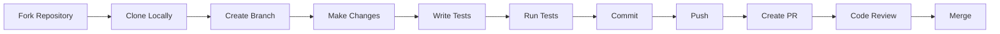

# Contributing Guide - {{PROJECT_NAME}}

> 🤝 Linee guida per contribuire al progetto
> Ultimo aggiornamento: {{TIMESTAMP}}

## 👋 Benvenuto!

Grazie per il tuo interesse nel contribuire a {{PROJECT_NAME}}! Questo documento fornisce linee guida e best practices per contribuire efficacemente al progetto.

## 📋 Table of Contents

- [Code of Conduct](#code-of-conduct)
- [Come Iniziare](#come-iniziare)
- [Processo di Sviluppo](#processo-di-sviluppo)
- [Linee Guida per Pull Request](#linee-guida-per-pull-request)
- [Convenzioni di Codice](#convenzioni-di-codice)
- [Testing](#testing)
- [Documentazione](#documentazione)

## 🤝 Code of Conduct

Ci impegniamo a mantenere un ambiente aperto e accogliente. Comportamenti non accettabili includono:

- ❌ Linguaggio o immagini offensivi
- ❌ Trolling o commenti provocatori
- ❌ Attacchi personali
- ❌ Molestie di qualsiasi tipo

**Reporting**: Segnala comportamenti inappropriati a {{CONDUCT_EMAIL}}

## 🚀 Come Iniziare

### 1. Setup Ambiente di Sviluppo

Segui la [Setup Guide](./setup.md) per configurare l'ambiente di sviluppo locale.

### 2. Trova un'Issue

- Controlla la [Issue board]({{ISSUES_URL}})
- Cerca issue etichettate con `good-first-issue` o `help-wanted`
- Commenta l'issue per farti assegnare

### 3. Crea un Branch

```bash
git checkout -b feature/your-feature-name
# oppure
git checkout -b bugfix/your-bugfix-name
```

**Branch naming convention**: {{BRANCH_NAMING_CONVENTION}}

## 🔄 Processo di Sviluppo

### Workflow Standard



### 1. Sviluppo

```bash
# Assicurati di essere sul branch corretto
git status

# Sviluppa la feature
# ...

# Controlla le modifiche
git diff
```

### 2. Testing

```bash
# Esegui tutti i test
{{TEST_COMMAND}}

# Esegui test specifici
{{TEST_SPECIFIC_COMMAND}}

# Verifica coverage
{{COVERAGE_COMMAND}}
```

**Coverage minimo richiesto**: {{MIN_COVERAGE}}%

### 3. Linting e Formatting

```bash
# Lint
{{LINT_COMMAND}}

# Format
{{FORMAT_COMMAND}}

# Fix automatici
{{AUTO_FIX_COMMAND}}
```

### 4. Commit

**Formato commit message**:

```
{{COMMIT_FORMAT}}
```

**Tipi di commit**:
- `feat`: Nuova feature
- `fix`: Bug fix
- `docs`: Modifiche alla documentazione
- `style`: Formattazione (no logic changes)
- `refactor`: Refactoring del codice
- `test`: Aggiunta/modifica test
- `chore`: Maintenance tasks

**Esempi**:
```
feat(auth): add JWT authentication
fix(api): resolve null pointer in user endpoint
docs(readme): update installation instructions
test(user): add tests for user service
```

**Best practices**:
- ✅ Usa presente imperativo ("add" not "added")
- ✅ Prima riga max 72 caratteri
- ✅ Aggiungi body per spiegare il "perché"
- ✅ Referenzia issue: `Closes #123`

### 5. Push

```bash
# Push del branch
git push origin feature/your-feature-name

# Se necessario force push (con cautela!)
git push origin feature/your-feature-name --force-with-lease
```

## 📬 Linee Guida per Pull Request

### Template Pull Request

```markdown
## Descrizione

Breve descrizione delle modifiche.

## Tipo di Cambiamento

- [ ] Bug fix (non-breaking change che risolve un issue)
- [ ] New feature (non-breaking change che aggiunge funzionalità)
- [ ] Breaking change (fix o feature che causa malfunzionamenti esistenti)
- [ ] Documentazione

## Come è stato testato?

Descrivi i test eseguiti per verificare le modifiche.

## Checklist

- [ ] Il codice segue le [style guidelines](./style-guide.md)
- [ ] Ho eseguito self-review del codice
- [ ] Ho commentato il codice, specialmente le parti complesse
- [ ] Ho aggiornato la documentazione
- [ ] Le modifiche non generano nuovi warning
- [ ] Ho aggiunto test che provano che il fix è efficace o che la feature funziona
- [ ] Test nuovi ed esistenti passano localmente
- [ ] Eventuali dipendenze downstream sono state mergiate e pubblicate

## Screenshots (se applicabile)

## Issue Correlate

Closes #(issue number)
```

### Requisiti PR

**Prima di creare una PR**:
- ✅ Branch aggiornato con `main`
- ✅ Tutti i test passano
- ✅ Linter non ha errori
- ✅ Coverage minimo raggiunto
- ✅ Documentazione aggiornata
- ✅ Commit ben formattati

### Review Process

1. **Automatic Checks**: CI/CD esegue test e linting
2. **Code Review**: Almeno {{MIN_REVIEWERS}} reviewer devono approvare
3. **Changes Requested**: Implementa feedback e push aggiornamenti
4. **Approval**: Una volta approvato, il maintainer farà il merge

### Cosa Aspettarsi

- ⏱️ **Prima review**: Entro {{REVIEW_TIME}} giorni lavorativi
- 🔄 **Iterazioni**: Potrebbero essere richieste modifiche
- ✅ **Merge**: Dopo approvazione e CI verde

## 📝 Convenzioni di Codice

Consulta la [Style Guide](./style-guide.md) completa.

### Quick Reference

```{{PRIMARY_LANGUAGE}}
// Naming
{{QUICK_NAMING_EXAMPLE}}

// Structure
{{QUICK_STRUCTURE_EXAMPLE}}

// Documentation
{{QUICK_DOC_EXAMPLE}}
```

## 🧪 Testing

### Tipologie di Test

1. **Unit Tests**: Testa singole unità di codice
2. **Integration Tests**: Testa interazione tra componenti
3. **E2E Tests**: Testa flussi completi utente

### Scrivere Buoni Test

```{{PRIMARY_LANGUAGE}}
{{GOOD_TEST_EXAMPLE}}
```

**Best practices**:
- ✅ Test dovrebbero essere deterministici
- ✅ Un test = una cosa testata
- ✅ Nomi descrittivi
- ✅ Arrange-Act-Assert pattern
- ✅ Mock dipendenze esterne

### Coverage Requirements

- **Overall**: {{OVERALL_COVERAGE}}%
- **New Code**: {{NEW_CODE_COVERAGE}}%
- **Critical Paths**: {{CRITICAL_COVERAGE}}%

## 📖 Documentazione

### Quando Aggiornare la Documentazione

- ✅ Nuove feature
- ✅ API changes
- ✅ Breaking changes
- ✅ Nuove dipendenze
- ✅ Setup/configurazione

### Documenti da Aggiornare

- `README.md`: Se cambia overview o quick start
- `docs/`: Documentazione tecnica dettagliata
- `CHANGELOG.md`: Tutte le modifiche significative
- Inline comments: Per logica complessa

### Stile Documentazione

- **Chiara e concisa**
- **Esempi di codice** dove utile
- **Screenshots/GIF** per UI changes
- **Diagrammi** per architettura complessa

## 🐛 Reporting Bug

### Template Bug Report

```markdown
**Descrizione Bug**
Descrizione chiara del bug.

**To Reproduce**
Steps per riprodurre:
1. Go to '...'
2. Click on '....'
3. See error

**Expected Behavior**
Cosa ti aspettavi che succedesse.

**Screenshots**
Se applicabile, aggiungi screenshots.

**Environment:**
 - OS: [e.g. iOS]
 - Browser [e.g. chrome, safari]
 - Version [e.g. 22]

**Additional Context**
Altre informazioni rilevanti.
```

## 💡 Feature Request

### Template Feature Request

```markdown
**Feature Desiderata**
Descrizione chiara della feature.

**Motivazione**
Perché questa feature sarebbe utile?

**Soluzione Proposta**
Come vorresti che funzionasse?

**Alternative Considerate**
Altre soluzioni che hai considerato?

**Additional Context**
Screenshots, mockup, etc.
```

## 🏷️ Issue Labels

| Label | Descrizione |
|-------|-------------|
| `bug` | Qualcosa non funziona |
| `enhancement` | Nuova feature o richiesta |
| `documentation` | Miglioramenti documentazione |
| `good-first-issue` | Buon punto di partenza per newcomer |
| `help-wanted` | Help extra richiesto |
| `priority-high` | Alta priorità |
| `wontfix` | Non verrà risolto |

## 🎯 Area di Contribuzione

Puoi contribuire in diversi modi:

### 💻 Code Contributions
- Implementare nuove feature
- Fixare bug
- Migliorare performance
- Refactoring

### 📚 Documentation
- Migliorare guide esistenti
- Aggiungere esempi
- Tradurre documentazione

### 🧪 Testing
- Scrivere nuovi test
- Migliorare coverage
- Test automation

### 🎨 Design
- UI/UX improvements
- Accessibilità
- Design system

### 💬 Community
- Rispondere a issues
- Code review
- Mentoring

## 🙏 Riconoscimenti

Tutti i contributori saranno riconosciuti nel:
- `CONTRIBUTORS.md`
- Release notes
- Project homepage

## 📞 Supporto

- **Documentation**: [{{DOCS_URL}}]
- **Discussions**: [{{DISCUSSIONS_URL}}]
- **Chat**: [{{CHAT_URL}}]
- **Email**: {{SUPPORT_EMAIL}}

## ⚖️ Licenza

Contribuendo, accetti che i tuoi contributi saranno licenziati sotto la stessa licenza del progetto: {{LICENSE}}

---

**Grazie per contribuire a {{PROJECT_NAME}}!** 🎉

*Generato automaticamente da Toduba System v{{TODUBA_VERSION}}*
